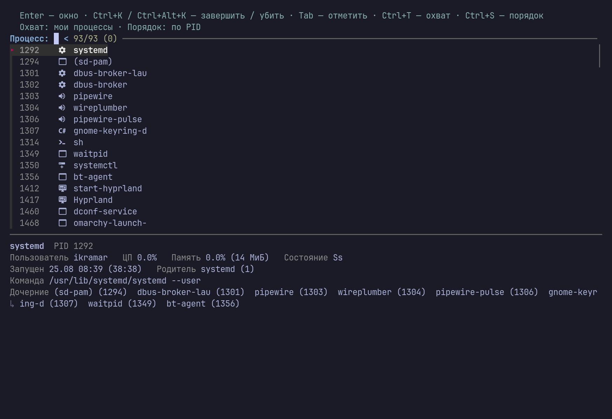
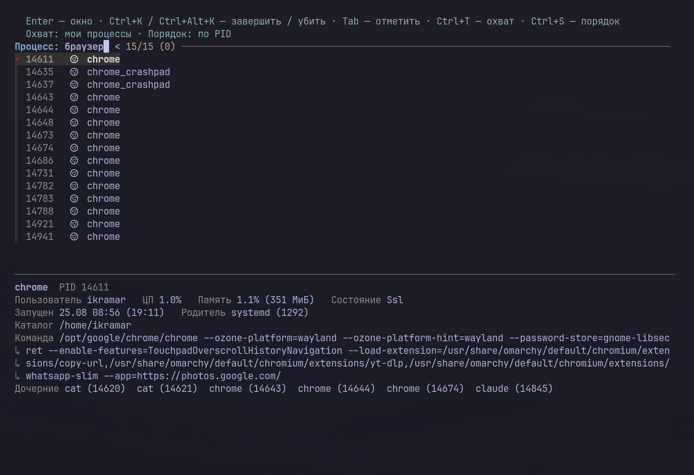
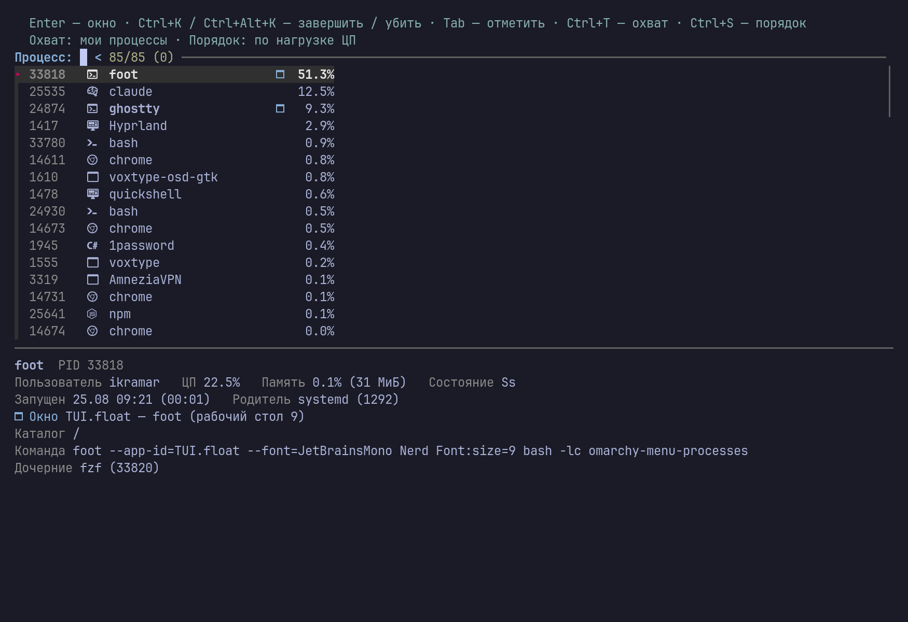

```
██████╗ ██████╗  ██████╗  ██████╗███████╗███████╗███████╗██╗   ██╗
██╔══██╗██╔══██╗██╔═══██╗██╔════╝██╔════╝██╔════╝██╔════╝╚██╗ ██╔╝
██████╔╝██████╔╝██║   ██║██║     █████╗  ███████╗███████╗ ╚████╔╝
██╔═══╝ ██╔══██╗██║   ██║██║     ██╔══╝  ╚════██║╚════██║  ╚██╔╝
██║     ██║  ██║╚██████╔╝╚██████╗███████╗███████║███████║   ██║
╚═╝     ╚═╝  ╚═╝ ╚═════╝  ╚═════╝╚══════╝╚══════╝╚══════╝   ╚═╝
```

<div align="center">

**Диспетчер процессов прямо в меню Omarchy.**

Пункт «Система → Процессы»: PID, иконка, имя, занятый порт. Поиск сразу по всем
колонкам, Enter переключает на окно процесса, Ctrl+K завершает его.

[](https://github.com/IgorKramar/omarchy-processes/actions/workflows/lint.yml)


</div>



---

## Быстрый старт

```bash
bash <(curl -fsSL https://raw.githubusercontent.com/IgorKramar/omarchy-processes/main/install.sh)
```

Установщик кладёт скрипт в `~/.local/bin`, объявляет пункт меню и, если у вас
русское меню от [omarchy-ru](https://github.com/IgorKramar/omarchy-ru),
пересобирает его. Повторный запуск безопасен: он меняет только то, что
разошлось, и делает бэкап каждого файла, который правит.

Открыть список: **Меню → Система → Процессы** или `omarchy menu summon processes`.

## Зачем это

`btop` показывает нагрузку, но плохо отвечает на вопрос «где окно вот этого
процесса и как его быстро закрыть». Здесь наоборот: список короткий, поиск
мгновенный, а Enter возвращает вас в окно программы — так же, как переключатель
окон, только с полным списком процессов за ним.

## Горячие клавиши

| Клавиша | Действие |
| --- | --- |
| `Enter` | Переключиться на окно процесса. Если своего окна нет, поиск поднимается по родителям; когда окна нет вовсе — открывается карточка процесса |
| `Ctrl+K` | Завершить процесс (`SIGTERM`) |
| `Ctrl+Alt+K` | Убить процесс (`SIGKILL`) |
| `Tab` | Отметить несколько процессов — сигнал уйдёт всем сразу |
| `Ctrl+T` | Охват: только мои процессы ⇄ все, включая системные |
| `Ctrl+S` | Порядок: по PID → по нагрузке ЦП → по памяти |
| `Ctrl+R` | Обновить список |
| `Esc` | Выход |

Процессы, на которых держится сеанс — Hyprland, quickshell, systemd, uwsm, dbus,
pipewire и им подобные, — защищены: сигнал до них не доходит, а в заголовке
появляется отказ.

## Поиск

Строка поиска смотрит не только на то, что видно на экране:

| Что ищется | Пример запроса |
| --- | --- |
| Номер процесса | `14611` |
| Имя процесса | `chrome`, `quickshell` |
| Категория иконки | `браузер`, `терминал`, `редактор`, `контейнер`, `звук`, `игра` |
| Командная строка | `--ozone-platform`, `/usr/lib/systemd` |
| Класс и заголовок окна | `ghostty`, часть названия вкладки |
| Занятый порт | `:3000`, `:5432`, `порт` — список всех, кто слушает |

Категория нужна потому, что сам глиф с клавиатуры не набрать: `браузер` находит
все процессы Chrome и Firefox, `терминал` — оболочки и эмуляторы терминала.
Запрос сопоставляется по подстроке, а несколько слов через пробел сужают выдачу
по очереди.



Порт ищется с двоеточием — `:3000`. Голое число тоже находит, но заодно
цепляет чужие командные строки, где эти цифры встречаются случайно. Найденный
процесс дальше обычный: Enter открывает его окно, `Ctrl+K` освобождает порт.
Порты видны у своих процессов; чужие показывает только `ss` от root, поэтому
при охвате «все» системные слушатели остаются без отметки.

Порядок можно переключить на нагрузку ЦП или память — тогда справа появляется
колонка с процентом:



## Как устроено

* `bin/omarchy-menu-processes` — один bash-скрипт поверх `fzf`. Строки собираются
  из `ps` и дополняются картой окон Hyprland (`hyprctl clients -j`), поэтому у
  процесса с окном появляется отметка, а Enter знает, куда переключаться.
* Слушающие TCP-порты берутся одним вызовом `ss -tlpnH` и раскладываются в
  карту «pid → порты». Только `LISTEN`: «занятый порт» на практике означает
  именно слушающий сокет, а UDP-строки почти целиком служебные — mDNS и
  резолвер. Один порт приходит дважды, по IPv4 и по IPv6, — дубль отсеивается.
* Иконка выбирается по имени процесса и классу окна — от точных имён (`cargo`,
  `pipewire`) к семействам (`*chrome*`, `*jetbrains*`). Каждая иконка тянет за
  собой набор поисковых слов, по которым её и находят.
* Поиск фильтрует сам скрипт, а не `fzf`: опция `--with-nth` преобразует строку
  до поиска, поэтому скрытые поля через неё не ищутся. Скрипт прогоняет полные
  строки через `fzf --filter --exact` и отдаёт наружу только три колонки. Поиск
  точный, по подстроке: нечёткий по командной строке даёт слишком много мусора —
  буквы запроса находятся вразброс в аргументах чужого демона.
* `fzf` перезагружает список на каждое нажатие клавиши, поэтому строки живут в
  кэше на три секунды: `ps` с обходом окон стоит слишком дорого, чтобы гонять
  его на каждую букву. `Ctrl+R` и любой сигнал сбрасывают кэш.
* Служебная цепочка самого списка (`fzf`, скрипт, его `ps`) из выдачи убрана —
  иначе `ps` каждый раз всплывал бы наверх с выбросом нагрузки.
* Пункт меню — обычная строка JSONC, которая запускает скрипт в плавающем
  терминале с `app-id=TUI.float`; правила Omarchy сами делают окно плавающим и
  ставят его по центру.

## Требования

* Omarchy 4 (Hyprland + оболочка на Quickshell);
* `fzf` и `jq` — установщик доставит их через `pacman`, если их нет;
* `ss` из `iproute2` — для колонки портов; без него список работает как раньше;
* шрифт Nerd Font в терминале — иконками служат его глифы;
* `hyprctl` нужен только для переключения на окно: без Hyprland список и сигналы
  работают, а Enter показывает карточку процесса.

## Настройка

**Свои иконки.** Таблица живёт в функции `icon_for` внутри скрипта: первый
`case` разбирает точные имена процессов, второй — шаблоны по имени и классу
окна. Строка задаёт глиф и слова, по которым он ищется:

```bash
*telegram*|*signal*|*discord*) icon="󰭹"; tags="общение chat мессенджер messenger" ;;
```

**Размер окна.** Плавающие окна Omarchy получают размер из правила
`floating-window`. Своё правило для этого списка — в `~/.config/hypr/`:

```lua
o.window("TUI.float", { size = { 1100, 700 } })
```

**Свои горячие клавиши.** Привязки собраны в вызове `fzf` в конце скрипта —
формат обычный для `fzf --bind`.

## Место в меню

Пункт встаёт последним в разделе «Система» — после «Выключения». Иначе никак:
оболочка сначала читает упакованное меню Omarchy и лишь затем пользовательское
расширение, так что новый идентификатор всегда дописывается в конец своего
раздела. Поднять его выше можно только клонированием плагина `menu`
(`omarchy plugin clone`), а это привязывает вас к сопровождению копии его кода
при каждом обновлении.

## Удаление

```bash
git clone https://github.com/IgorKramar/omarchy-processes.git
cd omarchy-processes && ./uninstall.sh
```

Скрипт убирает пункт из меню, удаляет `~/.local/bin/omarchy-menu-processes` и
чистит кэш. Правленые файлы меню перед изменением копируются с меткой времени.

## Родственные проекты

* [omarchy-ru](https://github.com/IgorKramar/omarchy-ru) — русская Omarchy одним
  установщиком: локаль, раскладка, перевод меню, терминал и шелл-набор.

## Лицензия

MIT — см. [LICENSE](LICENSE).
